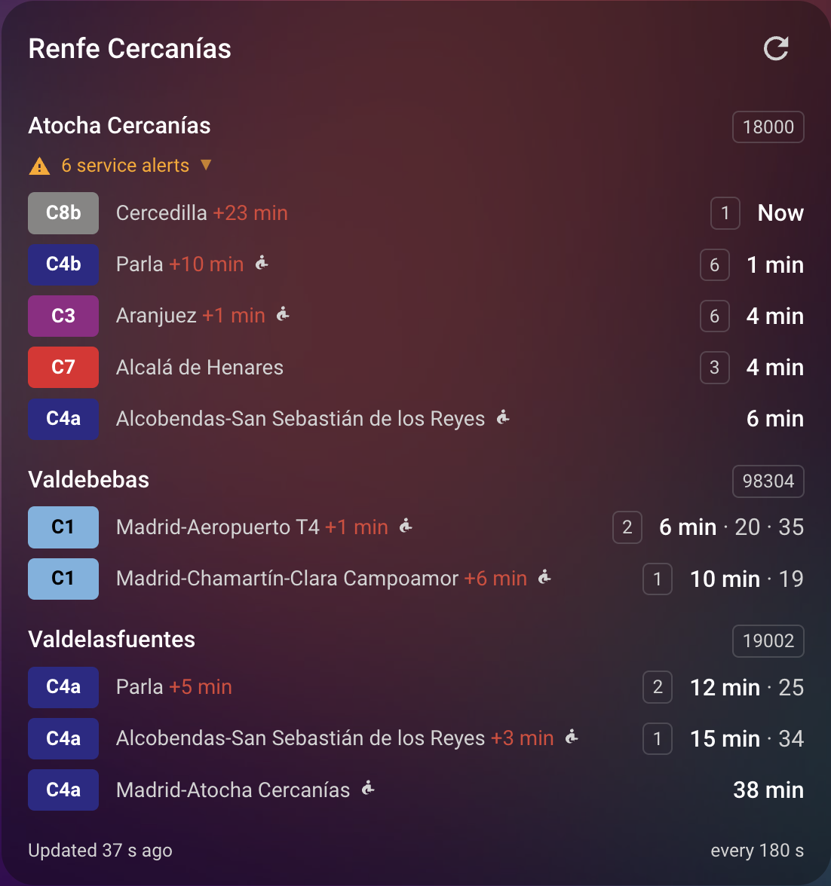

<h1 align="center">Renfe Tiempo Real</h1>

<p align="center">
  Real time Renfe Cercanías departures for Home Assistant
</p>

<p align="center">
  <a href="README.md">Léeme en español</a>
</p>

---

> This project was generated by [Kiro](https://kiro.dev), an AI-powered development
> environment. Anthropic Claude Opus 5 was used as LLM.

Real time departure sensors for any Renfe Cercanías station, using the same
public documents that feed the official viewer at
[tiempo-real.renfe.com](https://tiempo-real.renfe.com).

Works with all 15 commuter networks: Madrid, Asturias, Sevilla, Cádiz, Málaga,
Valencia, Murcia/Alicante, Cartagena, Ferrol, León, Rodalies de Catalunya,
Bilbao, San Sebastián, Cantabria and Zaragoza. 879 stations in total.

## Installation

### HACS

Add this repository as a custom repository of type *Integration*, install
**Renfe Tiempo Real** and restart Home Assistant.

### Manual

Copy `custom_components/renfe_tiempo_real` into the `config/custom_components`
directory of your Home Assistant and restart.

If you copy from macOS, use `rsync` or `scp` rather than `tar`: the macOS `tar`
writes extended attributes as `._name` siblings, which end up as junk on the
destination. With `tar`, export `COPYFILE_DISABLE=1` first.

## Configuration

Settings → Devices & services → Add integration → **Renfe Tiempo Real**. There
are three ways to identify the station:

- **Browse a commuter network** — pick the network, then the station from a list
  of every station in it.
- **Search by name** — type part of the station name, the network name or one of
  its lines. The search ignores case and accents and requires every word to
  match, so `madrid chamartin` works.
- **Enter the station code** — the station number (`18000` for Madrid-Atocha
  Cercanías, `71801` for Barcelona-Sants) or a link containing it.

Options (Configure button on the integration entry):

- **Update interval** — seconds between polls, 30 to 900, 180 by default. Renfe
  regenerates the departure board once a minute, so going below 60 buys nothing.
  The default is deliberately courteous to an endpoint nobody promised us; lower
  it if your commute needs it.
- **Departures to expose per route** — how many upcoming trains are listed in
  the `next_departures` attribute, 5 by default.
- **Fetch service alerts** — enables the alert sensor. Turning it off stops the
  integration downloading the alert document at all.

Every configured station is its own device, so you can add as many as you like.
The station catalogue and the global alert document are downloaded once and
shared by all of them.

## Actions

### `renfe_tiempo_real.refresh`

Polls Renfe immediately instead of waiting for the next scheduled update. Useful
on a dashboard button or at the start of a script that reads the sensors.

```yaml
# Refresh every configured station.
action: renfe_tiempo_real.refresh

# Refresh a single station, by entity or by device.
action: renfe_tiempo_real.refresh
target:
  entity_id: sensor.atocha_cercanias_next_departure
```

Without a target every configured station is refreshed. The call is debounced by
the coordinator: the first one runs immediately and repeats within a 10 second
window coalesce into a single request, so an automation gone wild cannot hammer
the Renfe service.

Home Assistant's own `homeassistant.update_entity` does the same thing;
`renfe_tiempo_real.refresh` exists because it can target a whole station at once
and reads better in automations.

## Dashboard card

The integration ships its own Lovelace card and registers it automatically, so
there is no resource to add by hand. After a restart: **Add card → Renfe -
Departures** (or paste the YAML below).

```yaml
type: custom:renfe-tiempo-real-card
```

That is all the configuration needed. The card finds every configured station by
itself and, for each one, draws a header with the name and the code, and below it
one row per route with the line badge in its official colour, the destination,
the delay, the platform and the waits. When the station has active alerts a
notice appears; pressing it unfolds the full text of each one. The footer shows
when the last successful poll happened and the configured interval, next to a
button that calls `renfe_tiempo_real.refresh`.

Every figure in a row carries its explanation in the `title`, so hovering tells
you what a `+17 min` or a bare `2` means.

<p align="center">
  
</p>

Options, all optional:

| Option | Default | Meaning |
| --- | --- | --- |
| `title` | `Renfe - Departures` | Card heading. Set it to `""` to hide it |
| `entities` | automatic | Station sensors to show, in this order. Also limits the refresh button to these stations |
| `departures_per_station` | `5` | Departures considered per station, spread across the rows of each route. Clamped to 1–12 |
| `show_platform` | `true` | Show the platform when Renfe has assigned one |
| `show_alerts` | `true` | Show the service alert notice |
| `expand_alerts` | `false` | Show the alert text unfolded from the start, for a dashboard nobody touches |

```yaml
type: custom:renfe-tiempo-real-card
title: Getting to work
departures_per_station: 3
show_platform: false
entities:
  - sensor.atocha_cercanias_next_departure
  - sensor.aranjuez_next_departure
```

### How to read a row

| What you see | What it is |
| --- | --- |
| `Atocha Cercanías` `18000` | Station name and code |
| `C3` | Line, in the official colour Renfe gives it in that network |
| `Aranjuez` | Destination, meaning the end of that train's run |
| `+1 min` | The delay Renfe reports against the timetable. Red when late, green with a minus sign when early. Not drawn when it is zero |
| `6` | The platform the train is expected on |
| `4 min` | The wait until departure: `Now` when it is leaving, `<1 min` under a minute, and a clock time from an hour out |
| `6 min · 20 · 35` | The next departure with its unit, then the following ones of the same route without repeating it |
| ♿ | Renfe marks that train as accessible |
| `6 service alerts` | Renfe warnings affecting the station or its lines. Press it to read them |

Behaviour worth knowing:

- Fewer rows are drawn when Renfe returns fewer departures; there are no filler
  slots for trains that do not exist.
- Each row is a route (line and destination). A through station like Atocha
  serves both directions of the C3 from a single code, so it produces one row per
  direction.
- `departures_per_station` counts departures, not rows: 5 departures spread
  across three routes give you three rows.
- Waits of an hour or more are shown as a clock time instead of "797 min".
- The delay is only drawn when it is not zero: red when the train is late, green
  when it is running early.
- The accessibility icon appears when Renfe marks the train as accessible.
- Pressing a row opens the more info dialog of that station.
- The text, including the default title, follows the Home Assistant language in
  Spanish and English.
- The "Updated x ago" label refreshes every 10 seconds without polling Renfe.
- If Renfe stops regenerating the board, the footer says so in red instead of
  showing the interval.

### If you prefer a plain button

The card button is the convenient option, but `renfe_tiempo_real.refresh` is a
normal action, so a button card works too:

```yaml
type: button
name: Refresh Renfe
icon: mdi:refresh
tap_action:
  action: perform-action
  perform_action: renfe_tiempo_real.refresh
```

## Entities

Every configured station becomes a device. Route entities are created per **line
and destination**, because a through station serves both directions of the same
line from a single code.

| Entity | State | Enabled by default |
| --- | --- | --- |
| `sensor.<station>_next_departure` | Minutes until the next train of any line | yes |
| `sensor.<station>_<line>_<destination>` | Minutes until the next train of that line and destination | yes |
| `sensor.<station>_data_timestamp` | Timestamp of the Renfe data, shown as "x minutes ago" | yes |
| `sensor.<station>_service_alerts` | Number of alerts affecting the station or its lines | yes |
| `sensor.<station>_<line>_<destination>_time` | Absolute departure time | no |

Minutes are computed against the Renfe server clock (`fechaActualizacion`), not
the local one, so a clock skew on the Home Assistant host does not distort the
estimates.

The `realtime` attribute tells you whether the train has already left its origin.
While it is `false`, the time Renfe publishes is the timetable rather than a real
time estimate.

A station with no train due, which is normal at night, keeps its entities but
reports `unknown` and sets `in_service: false`. A Renfe outage marks the entities
`unavailable`.

The Renfe board includes trains that **terminate** at the station, and those get
no entity: they are the train arriving at its last stop, not a departure you can
board. The station sensor counts them in the `terminating_count` attribute so
they do not vanish without a trace.

The reason lies in how Renfe serves the data. A station document is a slice of a
global stop-times listing: every trip appears once per station it calls at, with
the time at that station and the **end of the run** in `destino`. The same
`tripId` therefore leaves Aranjuez at 16:51 and Atocha at 17:37, with `destino`
Chamartín in both. When the station being queried is the end of the run,
`destino` equals the station itself and the time is the arrival, with no onward
departure. The official viewer does not filter them, which is why its panel shows
rows like "5 min · C7 · Madrid-Atocha Cercanías" while you are standing in
Atocha.

### Data freshness

Every sensor carries these attributes:

| Attribute | Meaning |
| --- | --- |
| `station_code` | The station code |
| `station_name` | The station name in the catalogue |
| `nucleus` | The commuter network it belongs to |
| `data_timestamp` | The timestamp of the data according to the Renfe backend |
| `last_polled` | When Home Assistant last polled *successfully*, in local time |
| `poll_interval_seconds` | The configured update interval |
| `in_service` | `false` when Renfe publishes no board for this station |
| `stale` | `true` when the board has not been regenerated for over 5 minutes |

`last_polled` only advances on a successful poll, so it always answers "how old
is what I am looking at". `sensor.<station>_data_timestamp` exists so you can put
it straight on a dashboard: being a `timestamp` sensor, the UI renders it as a
relative time.

Attributes of a route sensor:

```yaml
line: C3
line_colour: "#952585"
destination: Madrid-Chamartín-Clara Campoamor
destination_code: "17000"
departure_time: "2026-08-05T16:30:00+02:00"
scheduled_time: "2026-08-05T16:30:00+02:00"
delay: 0
platform: null
accessible: true
train: "20059"
status: null
realtime: false
next_departures:
  - line: C3
    line_colour: "#952585"
    destination: Madrid-Chamartín-Clara Campoamor
    destination_code: "17000"
    time: "2026-08-05T16:30:00+02:00"
    scheduled: "2026-08-05T16:30:00+02:00"
    minutes: 7
    delay: 0
    platform: null
    accessible: true
    train: "20059"
    status: null
station_code: "18000"
station_name: Atocha Cercanías
nucleus: Madrid
data_timestamp: "2026-08-05T16:22:41+02:00"
last_polled: "2026-08-05T16:22:43+02:00"
poll_interval_seconds: 180
in_service: true
stale: false
```

`status` is the position Renfe reports for the train: `at_station` stopped at a
station, `approaching` pulling into one, `en_route` running between two, and
`null` when it has not left its origin yet.

### Automation example

```yaml
automation:
  - alias: Leave for the C3 to Chamartín
    triggers:
      - trigger: numeric_state
        entity_id: sensor.atocha_cercanias_c3_madrid_chamartin_clara_campoamor
        below: 8
    actions:
      - action: notify.mobile_app
        data:
          message: >
            The C3 to Chamartín leaves in
            {{ states('sensor.atocha_cercanias_c3_madrid_chamartin_clara_campoamor') }}
            minutes from platform
            {{ state_attr('sensor.atocha_cercanias_c3_madrid_chamartin_clara_campoamor', 'platform') }}.
```

## The API

There is no documented or versioned API. The integration reads the same static
JSON documents the official viewer downloads, all under
`https://tiempo-real.renfe.com/`:

| Document | Contents |
| --- | --- |
| `data/estaciones.geojson` | Catalogue of all 879 stations: network, coordinates, lines, accessibility and connections |
| `renfe-json-cutter/write/salidas/estacion/<code>.json` | Departure board of one station, a rolling window of roughly two hours |
| `renfe-visor/flota.json` | Position and delay of every train in service |
| `renfe-visor/alerts.json` | Warnings and notices per station and per line, in several languages |

Details the integration normalises:

- The board answers `404` when the station has no train due. That is a state, not
  an error, and it does not mark the entities unavailable.
- The board is a per-station slice of a stop-times listing, so it includes the
  last stop of every trip. Those entries are kept out of the departures, as
  explained above.
- Times arrive as `dd-mm-yyyy HH:MM:SS` on the board and as ISO-8601 without an
  offset in the fleet document. Neither carries a timezone, so both are read in
  `Europe/Madrid`.
- `accesible` is `1`/`2` on the board and a boolean in the fleet document.
- Line colours come from `renfe-visor/lineas.geojson`, which is 1.5 MB of track
  geometry for 73 colours. The table is transcribed in `api.py` instead of being
  downloaded.
- The viewer's own JavaScript points the departure board and the alerts at
  `grt-nginx-visor-publico.desa.sir.renfe.es`, a host that does not resolve from
  the internet, which is why the departure board of the official viewer is
  broken. The equivalent paths on `tiempo-real.renfe.com` do work, and those are
  the ones used here.

## Development

```bash
uv venv --python 3.14
uv pip install pytest-homeassistant-custom-component ruff
.venv/bin/python -m pytest -q          # integration tests, network blocked
.venv/bin/ruff check custom_components tests scripts
.venv/bin/python scripts/live_check.py # check against the real API
```

Card tests, in jsdom:

```bash
npm install
npm test
```

`pre-commit` hooks (ruff, gitleaks and file checks):

```bash
uv pip install pre-commit
.venv/bin/pre-commit install          # once, enables the hooks
.venv/bin/pre-commit run --all-files  # check the whole repository
```

Validation with `hassfest`. Only `custom_components` is mounted: `hassfest` walks
the whole working directory looking for integrations, and if it finds the `.venv`
it validates the hundreds of Home Assistant integrations inside it too.

```bash
docker run --rm -v "$PWD/custom_components":/github/workspace/custom_components \
  ghcr.io/home-assistant/hassfest \
  --integration-path /github/workspace/custom_components/renfe_tiempo_real
```

## Data

The data belongs to [Renfe](https://www.renfe.com). The documents being polled
are neither documented nor versioned, so be considerate with the polling
interval.

## Licence

Code released under the [MIT](LICENSE) licence.

The logo of this integration is original artwork covered by the MIT licence of
the project. It is not the Renfe logo and does not imply any relationship with
Renfe.
